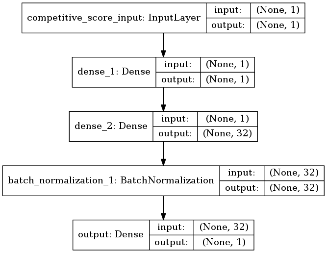
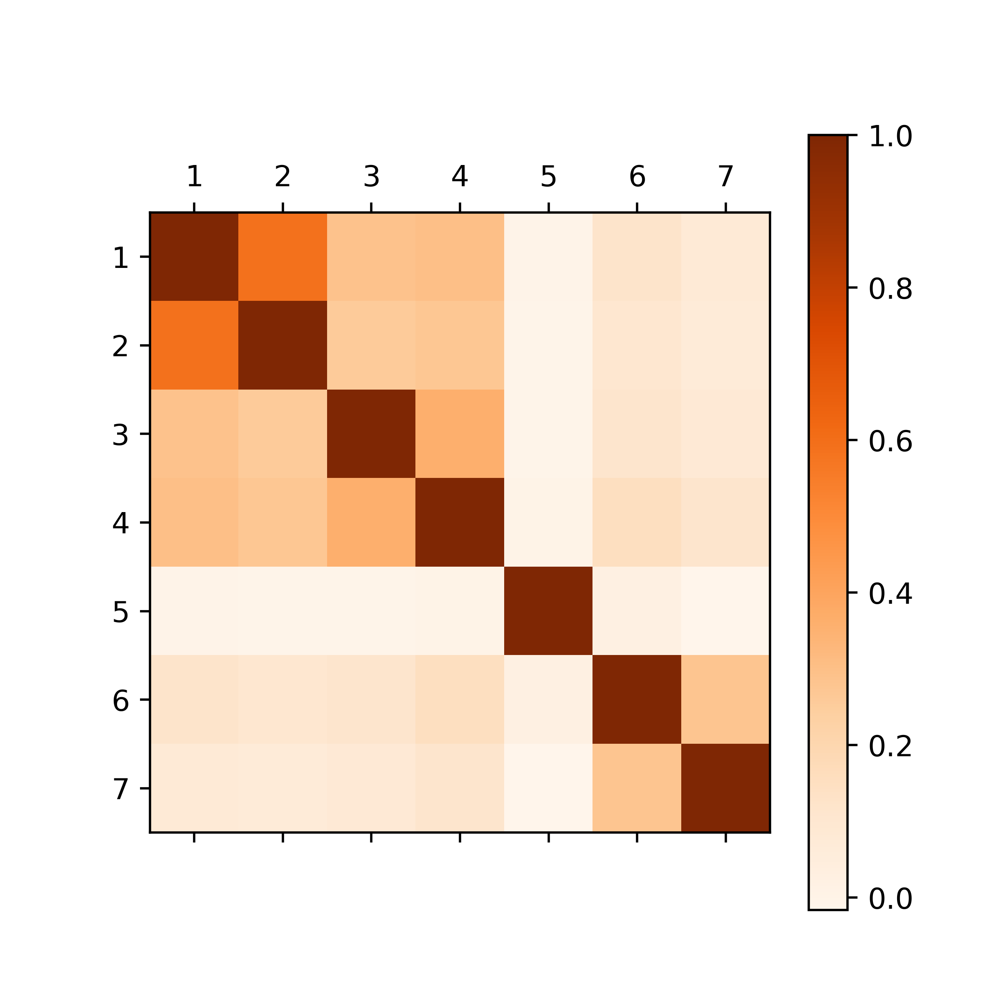

# Text Mining in Practice - Volume Prediction

## About
This project was developed during the project seminar _Text Mining in Practice_ at HPI.
More details about the course can be found here: https://hpi.de/naumann/teaching/teaching/ss-18/text-mining-in-practice-ps-master.html

Our goal was to build deep learning models for the prediction of the comment volume for newspaper articles.
We focused on articles of https://www.theguardian.com

## How to use the code

During the project, we've worked in different environments on different machines. Therefore, we've used docker in our development process.

### Docker
To use our setup, please go into the `docker` directory and run `docker-compose up`.
This setup dose not contain any code from this repository but provides a convenient environment.

We use ssh to access the VMs. To use your own ssh-public-key, please provide your key in `docker/setup/ssh_keys.pub`. 
The keys within this file will be installed within the container.

#### Setup
Our docker environment provides two machines (developer/production): each one has access to a different `postgres` database.
Each database can be administrated individually. For us it was a convenient approach to have a small amount of the production
database for our developer environment. For more details, please check out our [docker-compose.yml](docker/docker-compose.yml).

### Not using docker
Feel free not using docker, you just need to supply a postgres database.

### Database
To setup the database, please execute our [schema file](scripts/postgres.sql) on your postgres instance.

#### Import data
To import the data (authors, articles, and comments), you can use the ``run.py``, but we recommend to use a native 
postgres import strategy to speed up the process.  

### Settings.yml
Please make a copy of the ``setttings.default.yml -> settings.yml`` and adjust it to your environment.

### Execute code
Before you start, make sure to install all requirements with ``pip3 install -r requirements.txt``.
To run our models and further actions, please execute ``python3 run.py``. 

An overview of possible options will be given by using ``python3 run.py -h``

## Models

### Base Models

The models are created using descendants from the generic class `src.models.model_builder.ModelBuilder`.
We created the following base models:

#### Headline Dense (`src.models.model_1.py`)

This model used a trainable embedding layer converting the headline words to a headline embedding matrix.
The network also uses two dense layers (hence the name).

#### Headline Convolution (`src.models.model_2.py`)

This model uses the same embedding as the _Headline Dense_ model.
The embeddings get transformed by an embedding layer with three different kernel sizes and max-pooling is used afterwards.

#### Article LSTM (`src.models.model_3.py`)

This model uses the first words of an article text, embedds them like the _Headline Dense_ model, and uses a LSTM-Layer to process the embedded words.

#### Category (`src.models.model_4.py`)

This model uses the category of an article and two dense layers.

#### Time (`src.models.model_5.py`)

This model uses multiple time features extracted from the release time stamp of the article.
The time features are:

* minute
* hour
* day of the week
* day of the year

The time features get embedded and processed through two dense layers.

#### Headline, Article Length (`src.models.model_6.py`)

This model uses the logarithm from the headline and the article word count.
The logarithm is used to create exponential sized bins for the articles.
The difference between 900 and 1000 words is not important rather than the difference between 50 and 150 words.

The logarithms get embedded and processed through two dense layers.

#### Competitive Score (`src.models.model_7.py`)

This model uses a self computed competitve score.
The competitive score is used to express the competition for every article.
It is calculated using the formula:

with

### Combined Models

Based on the performance and the correlation of the base models, we combined certain models.

The correlations can be seen here:

#### `src.models.model_23.py`

#### `src.models.model_24.py`

#### `src.models.model_25.py`

#### `src.models.model_26.py`

#### `src.models.model_27.py`

#### `src.models.model_34.py`

#### `src.models.model_234.py`

